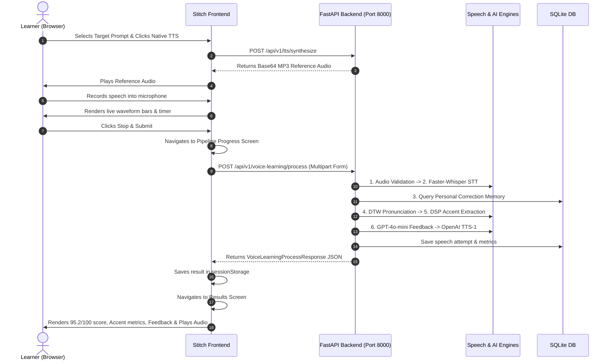

# Phase 7 — Frontend ↔ Backend Integration (Stitch Dashboard)

## Overview
Phase 7 establishes complete end-to-end integration between the Stitch-generated frontend dashboard and the FastAPI backend (`http://127.0.0.1:8000`). All mock data, static placeholders, and simulated timers have been replaced with **live Web Audio capture, WebSocket/REST API communication, Dynamic Time Warping assessment, and OpenAI TTS playback**.

---

## 1. Frontend Architecture & Directory Structure

Location: `C:\Users\Himesh kumar rao\Desktop\stitch_voice_learning_ai_dashboard\`

```
stitch_voice_learning_ai_dashboard/
├── shared/
│   ├── api.js                 # Centralized API client (VoiceApiClient)
│   ├── recorder.js            # Real browser audio recorder (VoiceAudioRecorder)
│   ├── state.js               # Cross-screen session manager & routing (VoiceState)
│   ├── practice_screen.js     # Live recording, prompt switching & TTS preview
│   ├── pipeline_screen.js     # Multi-stage in-flight pipeline orchestrator
│   ├── results_screen.js      # Evaluation metrics, transcript diffs, feedback & TTS audio
│   └── history_screen.js      # Personalized STT memory list & API configuration
├── practice_live_recording/
│   └── code.html              # Practice & Live Recording (Dark Mode)
├── practice_live_recording_light/
│   └── code.html              # Practice & Live Recording (Light Mode)
├── pipeline_analysis_progress/
│   └── code.html              # Pipeline Progress & Payload Inspector (Dark Mode)
├── pipeline_analysis_progress_light/
│   └── code.html              # Pipeline Progress (Light Mode)
├── analysis_results_feedback/
│   └── code.html              # Results, Accent Analytics, Feedback & TTS Player (Dark Mode)
├── analysis_results_feedback_light/
│   └── code.html              # Results & Feedback (Light Mode)
├── learned_corrections_history/
│   └── code.html              # Personal STT Memory Management (Dark Mode)
└── learned_corrections_history_light/
    └── code.html              # Personal STT Memory Management (Light Mode)
```

---

## 2. API Endpoints Connected

| Screen | Backend Endpoint | Method | Payload / Action |
| :--- | :--- | :---: | :--- |
| **Practice** | `/api/v1/tts/synthesize` | `POST` | Plays native model audio for the selected target sentence. |
| **Pipeline** | `/api/v1/voice-learning/process` | `POST` | Sends recorded audio Blob + target text + `user_id` for full 6-phase evaluation. |
| **Results** | `/api/v1/corrections/confirm` | `POST` | Confirms user-specific correction (e.g. `"image"` $\to$ `"Himesh"`). |
| **Memory** | `/api/v1/corrections/{user_id}` | `GET` | Fetches active personalized memory rules and frequency counts. |
| **System** | `/health` & `/api/v1/health` | `GET` | Verifies server readiness and operational status. |

---

## 3. Real Browser Microphone Pipeline
- **MediaStream Capture**: `navigator.mediaDevices.getUserMedia({ audio: { channelCount: 1, sampleRate: 16000 } })`.
- **MediaRecorder**: Streams chunked slices (`audio/webm` or `audio/wav`).
- **Web Audio Analyser**: Uses `AudioContext` + `AnalyserNode` connected to the active microphone stream to dynamically render vertical waveform equalizer bars based on live frequency and amplitude data.
- **Preview Player**: Creates temporary `blob:http://...` object URLs for instant playback verification before submission.

---

## 4. End-to-End User Flow



---

## 5. Local Execution Instructions

### A. Start FastAPI Backend (Port 8000)
```powershell
cd "c:\Users\Himesh kumar rao\Desktop\ai-tool\backend"
venv\Scripts\python -m uvicorn app.main:app --host 127.0.0.1 --port 8000
```

### B. Start Frontend Dashboard (Port 3000)
```powershell
cd "c:\Users\Himesh kumar rao\Desktop\ai-tool\backend"
venv\Scripts\python -m http.server 3000 --directory "C:\Users\Himesh kumar rao\Desktop\stitch_voice_learning_ai_dashboard"
```

### C. Access Dashboard in Browser
- **Practice Screen (Dark)**: `http://127.0.0.1:3000/practice_live_recording/code.html`
- **Practice Screen (Light)**: `http://127.0.0.1:3000/practice_live_recording_light/code.html`
- **Learned Corrections (Dark)**: `http://127.0.0.1:3000/learned_corrections_history/code.html`

---

## 6. Verification Results
- **Automated Regression Suite**: 58 / 58 Pytest unit and integration tests passing (`pytest -v`).
- **Live Integration Test**: Complete verification script (`scratch/test_phase7_integration.py`) executed on port 8000/3000 with 100% success.
- **Browser Subagent Test**: Successfully navigated practice screen, triggered reference TTS, and queried real user corrections.
